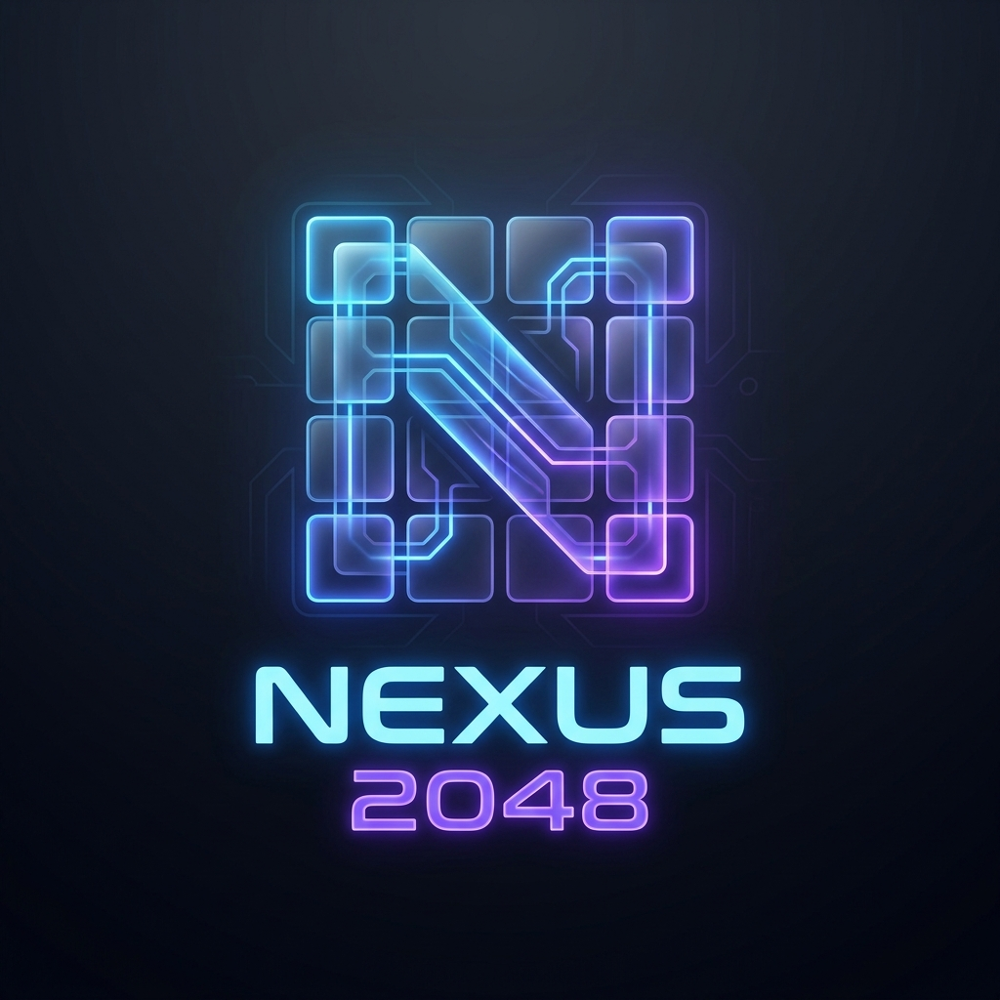

# Nexus 2048 Game

A minimalist, polished, and modern clone of the famous 2048 game. Join the numbers and get to the **Nexus 2048 tile!**



## 🚀 Live Demo
Play it here: [https://jet2511.github.io/2048/](https://jet2511.github.io/2048/)

## ✨ Features
- **Multiple Grid Sizes**: Choose from 3x3, 4x4, 5x5, or 6x6 grids for different challenge levels.
- **Independent High Scores**: Best scores are tracked and saved separately for each grid size.
- **Undo Move**: Made a mistake? Undo your last moves (with a small score penalty for balance!).
- **Reverse Undo Animation**: Fluid reverse movement when undoing, making the experience extra smooth.
- **Modern Dark Mode**: Full-page dark mode support with a refined, professional color palette.
- **Aesthetic Typography**: Upgraded to modern fonts (Lexend, Outfit, Inter) for better readability.
- **Polished UX**: Persistent settings, confirmation dialogs, and a perfectly aligned header.
- **Mobile Friendly**: Fully responsive design for playing on any device.

## 🛠️ How to Play
1. Use your **Arrow Keys** (or swipe on mobile) to move the tiles.
2. When two tiles with the same number touch, they **merge into one!**
3. Reach the **2048** tile to win, but you can keep going for higher scores!

## 📂 Project Structure
```text
2048/
├── assets/
│   ├── css/            # Modular Stylesheets
│   │   ├── main.css    # Entry point (imports modules)
│   │   ├── base.css    # Variables & resets
│   │   ├── ui.css      # UI components & settings
│   │   ├── game.css    # Game board & layout
│   │   ├── tiles.css   # Tile colors & styles
│   │   └── animations.css # Keyframe animations
│   ├── js/             # Core game logic (Modern ES6+)
│   ├── meta/           # Icons and social media assets
│   └── fonts/          # Typography
├── index.html          # Main entry point
└── README.md           # Project documentation
```

## 🤝 Acknowledgements
- Based on the original [2048 by Gabriele Cirulli](http://2048.io/).
- Conceptually similar to [Threes by Asher Vollmer](http://asherv.com/threes/).
- Originally created by [Tuyen Ha Le](https://github.com/jet2511).

## 📄 License
This project is open-source and available under the [MIT License](LICENSE).
